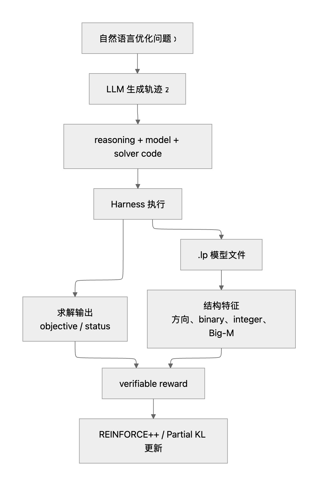

## Introduction

The NeurIPS 2025 paper, **Solver-Informed RL: Grounding Large Language Models for Authentic Optimization Modeling**  [@chen2026solver], 
presents a pioneering approach to applying Reinforcement Learning with Verifiable Rewards (RLVR) to train LLMs for optimization tasks.
Its core contribution is **Solver-Informed Reinforcement Learning(SIRL)**,
a tailed RLVR framework that incorporates optimization solvers into the model-training loop. 

By interacting with external solvers such as Gurobi and COPT, the SIRL framework converts generated optimization code into concrete execution signals, including solver syntax status, infeasibility indicators, objective values, and decision-variable assignments.
These signals are then transformed into structured and verifiable rewards. 
Instead of evaluating generated code solely on syntax or similarity to reference solutions, 
the framework assesses whether the resulting mathematical model  is valid, feasible, and capable of producing the intended optimization solution.
In this process, the solver acts as a strict and objective referee. Its feedback helps iteratively refine the LLM’s policy, directly aligning code generation with mathematical correctness and solver-verified performance. As a result, the model develops greater proficiency in formulating and solving authentic optimization problems.

In this post, we look under the hood of the SIRL framework's engineering backbone: a specialized harness designed for secure code execution and evaluation in LLM-driven optimization modeling. 
By routing generated code directly into sandboxed optimization solvers, this harness manages code re-expression, execution dispatch, and the critical translation of raw runtime outcomes into the multi-dimensional reward signals essential for the RLVR (Reinforcement Learning with Verifiable Rewards) training loop.
Closing the loop between generation and execution empowers LLMs to safely test, evaluate, and iteratively refine their code against real solver dynamics. Ultimately, this framework for secure execution, solver integration, and failure handling is the missing link that allows Solver-Informed RL to graduate from clean academic testbeds to messy, highly constrained real-world business environments.

### What is Harness Engineering?
Following the paradigms of prompt engineering and context engineering, harness engineering has emerged as a new approach for building reliable AI systems. It gained widespread attention after the release of the OpenAI technical report <<Harness Engineering: Leveraging Codex in an Agent‑First World>> [@lopopolo2026harness].

Because large language models are built on transformer architectures and autoregressive sampling, their outputs are inherently stochastic. Even the most capable models can give different answers to the same prompt, make inconsistent decisions, or fail unpredictably. Harness Engineering tackles this uncertainty by enveloping the model in a dedicated layer of software infrastructure and control logic. This layer governs how the model receives information, invokes tools, executes actions, validates outputs, handles failures, and incorporates feedback.
Its purpose is to anchor a high-entropy generative engine into a controllable, verifiable, and closed-loop system. Through a meticulously designed execution harness, LLMs can be securely encapsulated and deployed into mission-critical business workflows that demand uncompromising stability and auditability.

A simple way to express this idea is:
$$
AI\text{-}Agent = \underbrace{\text{SOTA Model}}_{\text{the wild horse}}
+ \underbrace{\text{Harness}}_{\text{the control system}}.
$$

The harness determines whether that capability of current SOTA LLMs can be deployed safely, consistently, and effectively in the real world.

## Harness Framework in the Context of Optimization Modeling
In a standard Harness Engineering pipeline for code agents, execution is relatively straightforward: the LLM generates a standalone code snippet, which is then executed and validated through a tool call inside an isolated sandbox.

Optimization solvers (such as Gurobi, COPT, or Google OR‑Tools) have a distinctive characteristic: they demand an object‑oriented workflow. You first initialize a core model instance, then programmatically attach decision variables, constraints, and the objective function, step by step.
To see this pattern in action, consider a canonical textbook example—the tire transportation problem (strictly speaking, an integer linear programming problem):

```python
A company needs to transport at least 200 tires to meet demand. Two modes of transportation are available:
* Air Transport: Capacity of 10 tires per trip at a cost of $1,000 per trip.
* Truck Transport: Capacity of 6 tires per trip at a cost of $700 per trip.

Constraints:
1. Budget Cap: Total transportation cost cannot exceed $22,000.
2. Trip Ratio: The number of air trips cannot exceed the number of truck trips.
3. Demand Requirement: Total tires transported $\ge 200$.

Objective: Determine the optimal number of air and truck trips to minimize the total number of trips while satisfying all constraints.
```

Below is a complete Gurobi script that prints both the optimal objective value and the decision variables.

```python
from gurobipy import GRB

m = gp.Model()
x = m.addVar(vtype=GRB.INTEGER, name="x")
y = m.addVar(vtype=GRB.INTEGER, name="y")

m.setObjective(x + y, GRB.MINIMIZE)
m.addConstr(10*x + 6*y >= 200)
m.addConstr(1000*x + 700*y <= 22000)
m.addConstr(x <= y)

m.optimize()

if m.status == GRB.OPTIMAL:
    print(f"Just print the best obj: {m.objVal}")
    print("Just print the best sol: [", end="")
    for var in m.getVars():
        print(f"{var.X}", end=",")
    print("]")
else:
    print("No optimal solution found")
```

However, when LLMs are used to generate such code snippets,
whether through multi‑sample generation or RLVR training,
each optimization task typically requires sampling multiple responses in parallel, 
with each response containing a candidate script (n‑rollouts, e.g., $n=8$ or $n=16$). 
Due to the inherent stochasticity of LLMs, 
these scripts diverge wildly in how they format logs, name variables, and print optimization results, making automated extraction and parsing notoriously brittle. 

1. Incomplete execution log: 
the code fails to print any information about the optimal value or decision variables (e.g., the script runs without errors but produces no output).

```python
import gurobipy as gp
from gurobipy import GRB

m = gp.Model()
x = m.addVar(vtype=GRB.INTEGER, name="x")
y = m.addVar(vtype=GRB.INTEGER, name="y")
m.setObjective(x + y, GRB.MINIMIZE)
m.addConstr(10*x + 6*y >= 200)
m.addConstr(1000*x + 700*y <= 22000)
m.addConstr(x <= y)
m.optimize()
```

2. Partial execution log: 
the code produces incomplete output, printing only the objective function value (optimal value) while omitting the solution vector:

```python
import gurobipy as gp
from gurobipy import GRB

m = gp.Model()
x = m.addVar(vtype=GRB.INTEGER, name="x")
y = m.addVar(vtype=GRB.INTEGER, name="y")
m.setObjective(x + y, GRB.MINIMIZE)
m.addConstr(10*x + 6*y >= 200)
m.addConstr(1000*x + 700*y <= 22000)
m.addConstr(x <= y)
m.optimize()
if m.status == GRB.OPTIMAL:
    print(f"The optimal value = {m.objVal}")
```

This output inconsistency poses a serious challenge for automated evaluation and reward calculation in RLVR training loops. To address it, the authors of SIRL introduced a lightweight Intermediate Representation (IR) Injection framework specifically designed for solver‑integrated optimization training.

The core idea is straightforward: rather than relying on prompt engineering to force the LLM to output standardized print statements, 
the framework dynamically injects a standardized execution block for the generated code snippet. 
The core idea is simple: instead of relying on prompt engineering to force the LLM to emit standardized print statements, the framework dynamically injects a standardized execution block into the generated code. This augments the execution without imposing rigid formatting constraints on the model's prompt or text generation.
Specifically, the framework’s workflow consists of three key steps:

   1. Dynamic instance Matching: Uses regular expressions to precisely capture the model object instance within the generated code. 
   For example, based on standard solver syntax, the regex (\s*)(\w+)\.(solve|optimize)\(\) extracts the model instance name (e.g., $m$), and the specific call method.
   2. Adaptive status‑check generation – Based on the target solver backend, the framework automatically generates the appropriate optimality check:
      * COPT solver → COPT.OPTIMAL
      * Gurobi solver → GRB.OPTIMAL

   3. Forced injection / replacement – Once the model instance and solver action are identified, the harness automatically appends an additional code snippet that injects status verification and standardized output. This ensures the program reliably prints the Status, the Best Obj (optimal objective value), and the Best Sol (all decision variables).

Consider the earlier incomplete Gurobi script, which lacked any output logic. When the injection framework detects m.optimize(), it automatically injects the output logic needed for downstream RLVR—printing the optimal objective value and the full solution vector. The transformation is shown below:

```python
... # initialization and modeling omitted
m.optimize()
```

After injection (modified in‑memory before sandbox execution):

```python
# ... # initialization and modeling omitted
m.optimize()
if m.status == GRB.OPTIMAL:
    print(f"Just print the best obj: {m.objVal}")
    print("Just print the best sol: [", end="")
    for var in m.getVars():
        print(f"{var.X}", end=",")
    print("]")
else:
    print("No optimal solution found")
```
This rewrite-and-inject strategy cleanly decouples LLM generation from sandbox execution. By freeing the model from managing complex mathematical modeling and rigid output formatting simultaneously, IR Injection significantly enhances training efficiency, accelerates convergence, and improves evaluation robustness.
As detailed in the original paper, the SIRL framework treats external solvers as verifiers within the RLVR paradigm. The pipeline proceeds in three steps: (1) the LLM generates a reasoning trace, a problem formulation, and executable solver code; (2) an IR injection engine intercepts and rewrites the generated scripts; (3) the engine then uses both the runtime execution logs and the resulting .lp model files to compute the final reward. The overall process is illustrated below:

{#fig-example}


### Unlocking Richer Feedback Signals: From Final results to Internal States
By leveraging the Intermediate Representation (IR) Injection mechanism, the SIRL harness reliably standardizes solver outputs, effectively mitigating the variance inherent in LLM-generated formatting. Crucially, the utility of this harness extends well beyond parsing terminal results. By penetrating deeper into the solver's execution stack, it exposes a wealth of metadata, intermediate search trajectories, and diagnostic telemetry to upper-layer RLVR pipelines and multi-agent frameworks.

For complex industrial optimization applications, 
this deep observability is realized by dynamically embedding lightweight diagnostic hooks throughout the solver's lifecycle. Rather than relying on sparse, binary success/failure signals, these hooks stream continuous data regarding intermediate optimization states, algorithmic bottlenecks, and structural mathematical traits. Equipped with this high-resolution feedback, LLMs gain the contextual depth necessary for multi-step reflection, precise root-cause diagnosis, and adaptive algorithmic tuning. Consequently, the model transitions from merely observing that a solution failed, to fundamentally understanding why a specific formulation or computational strategy succeeds, stalls, or collapses. Below, we detail representative diagnostic signals extractable via this framework.
Here, We outline several representative diagnostic signals extracted via this framework below:

   1. Profiling Execution Quality and Computational Latency:

```python
# Capture solver runtime to benchmark the complexity of the generated model
solve_time = m.Runtime

# Extract the complete constraint matrix A (returns scipy.sparse.csr_matrix)
# This allows us to detect if the LLM's formulation inadvertently caused a highly dense or ill-conditioned matrix
A = m.getA()
```
Here we retrieve the constraint matrix A as a scipy.sparse.csr_matrix, which iis Useful for evaluating sparse structure density and condition metrics.

   2. Root Cause Analysis (RCA) for Infeasibility:
```python
if m.Status == GRB.INFEASIBLE:
    # Compute the Irreducible Inconsistent Subsystem (IIS)
    m.computeIIS()
    # Precisely isolate the fragment of conflicting constraints for the LLM to debug
    m.write("conflict_model.ilp")
```
When an LLM produces contradictory constraints, runtime error messages are often insufficient. We can instruct the solver to compute an Irreducible Inconsistent Subsystem (IIS) to isolate the conflict.


   3. Probe C: Economic Signals and Sensitivity Analysis:
```python
# Get shadow prices for all constraints
pi_vals = m.getAttr('Pi', m.getConstrs())
# Get reduced costs for all decision variables
rc_vals = m.getAttr('RC', m.getVars())
```

 Sensitivity Analysis & Economic SignalsFor linear programming tasks, dual metrics provide direct operational signals beyond primal decision variable value. By pairing solver backends with an IR-injection Harness engine, we establish a robust interface between probabilistic language models and deterministic mathematical solvers—enabling scalable RL training and dependable real-world deployments.


## Toward Multi-Agent Collaboration: Generalizing the Harness Framework

### A General Multi-Agent Framework
Building upon our aforementioned  Intermediate Representation (IR) Injection mechanism, 
the Harness framework’s capacity for optimization modeling 
can naturally extends to higher-level optimization task solving and can 
serve as the perfect foundation for a Multi-Agent System (MAS) tailored to to tackle complex, enterprise-grade operations research problems.

Inspired by multi-agent optimization frameworks such as Optimus*[@ahmaditeshnizi2023optimus],
we can we can construct a fully automated workflow designed for high-complexity optimization tasks.
 built around a clear pipeline: **Problem  Parsing $\to$ Code Generation $\to$ Execution with Feedback $\to$ Diagnostic Remediation**.

```
[ Problem Description ]
          |
          v
+------------------+
|  Agent A: Modeler|  (Extracts business domain boundaries & math objectives)
+--------+---------+
         |
         v
+------------------+
| Agent B: Solver  |  (Generates code + injects diagnostic hooks: IIS, duals)
+--------+---------+
         |
         v
+------------------+
| Harness Engine   |  (Rewrite and Executes in sandbox, extracts logs & metadata)
+--------+---------+
         |
         v
+------------------+
|Agent C: Reflector|  (Diagnoses matrix ill-conditioning, IIS conflicts, dual gaps)
+--------+---------+
         |
         v
+------------------+
| Agent D: Refiner |  (Relaxes constraints, adjusts bounds, resolves logic issues)
+------------------+

```

* **Agent A (Business Modeler):** Parses unstructured natural language to extract core business objectives, operational constraints, and domain assumptions.
* **Agent B (Optimization Solver):** Translates specifications into code while leveraging the Harness to inject low-level diagnostic hooks (e.g., `model.computeIIS()`, dual variable extractors) for downstream observability.
* **Agent C (Reflection Expert):** Analyzes execution logs, IIS output, and shadow prices returned from the sandbox, identifying underlying issues like numerical instability, contradictory constraints, or over-constrained formulations.
* **Agent D (Code Refiner):** Applies targeted repairs based on Agent C's diagnostics—relaxing tight bounds, updating penalty factors, or resolving logical conflicts—to complete the iteration cycle/loop.

The key role of the Harness is to make the solver's otherwise hidden internal states explicit, structured, and machine-readable. Through structured code injection and solver instrumentation, information such as execution traces, IIS results, dual variables, and performance statistics becomes directly accessible to the agents.

This dramatically changes the optimization loop. Instead of relying on a coarse success/failure signal, agents can reason over detailed solver evidence and perform targeted revisions. The Harness therefore acts as an information engine that connects low-level solver execution with high-level agent reasoning.

As LLM-based optimization modeling moves toward real industrial workloads, such an architecture becomes increasingly valuable. The same closed-loop design can be adapted to supply-chain planning, energy systems, portfolio optimization, transportation, manufacturing, and other domains where solving the mathematical program is only one component of the overall decision process.


| Application                           | Solver Signal Exposed by the Harness                                | Adaptive Agent Action                                                                                                                            |
| ------------------------------------- | ------------------------------------------------------------------- | ------------------------------------------------------------------------------------------------------------------------------------------------ |
| **Power-System Unit Commitment**      | Dual information associated with operational or network constraints | Identify economically stressed parts of the system and revise generation, reserve, or dispatch decisions accordingly                             |
| **Supply-Chain Network Optimization** | IIS / conflicting constraint subsets                                | Locate contradictory inventory, capacity, or service-level constraints and selectively convert hard requirements into penalized soft constraints |
| **Portfolio Optimization**            | Shadow prices of capital, exposure, or risk constraints             | Estimate the marginal value of relaxing investment restrictions and adjust allocation limits across asset groups                                 |

In this pipeline, the solver is no longer merely the execution backend of an LLM-generated program. It becomes an active participant in the reasoning loop, continuously producing structured signals that specialized agents can interpret, diagnose, and act upon.


### Harness Engineering for Power-System Optimization

To illustrate how our Harness-driven multi-agent architecture scales to complex vertical domains, 
we examine ProOPF*[@shen2026proopf]("Benchmarking and Improving LLMs for Professional-Grade Power Systems Optimization Modeling") as a concrete case study. 
Power system optimization presents a uniquely demanding environment: tasks are strictly time-critical, tightly bound by physical laws, and historically dependent on the tacit, manual expertise of power engineers. 
With the powerfulness of semantic reasoning and formal code generation, LLMs agents can translate an power operator's high-lvel requirements directly into executable matehmatical modeling and solver code paving a practical path toward end-to-end automated power system modeling.

However, existing optimization benchmarks mostly target broad, cross-domain tasks and fall short of the strict standards required for industrial power systems. In real-world grid operations, "correct" code means much more than passing a syntax check or reaching a feasible status. Mission-critical workflows like Optimal Power Flow (OPF) must satisfy complex physical laws, operational bounds, and network topology constraints. ProOPF addresses this limitation by offering a specialized benchmark for professional-grade power system optimization. It provides a realistic testbed to measure whether LLMs can accurately translate intricate grid specifications into production-ready, executable optimization code.
Specifically, ProOPF encapsulates a spectrum of benchmark power system optimization problems—including OPF, SCUC, and SCED—characterized by deeply nested constraint structures. Formulations in this domain must concurrently satisfy physical power-flow equations, discrete equipment status variables, hard operating limits, $N-1$ security criteria, and inter-temporal scheduling dynamics. This multi-faceted modeling friction positions ProOPF as an ideal benchmark for validating the proposed Harness framework

Examining the mathematical taxonomy of these tasks demonstrates why standard LLM code generation falls short. The solver ecosystem for power grids is fundamentally heterogeneous. Rather than relying on a uniform compilation target, an intelligent LLM agent must dynamically route formulations based on their mathematical geometry and required execution loop:

| Grid Problem | Mathematical Formulation | Typical Solver / Execution Pathway |
| --- | --- | --- |
| **AC-OPF** | Non-convex NLP | MATPOWER MIPS / IPOPT / KNITRO |
| **DC-OPF & SCED** | LP / QP | Gurobi / COPT / CPLEX |
| **SCUC** | MILP | Branch-and-Bound + Cutting Planes |
| **SCOPF ($N-1$)** | Security-Constrained Extension | Iterative Contingency Screening + Master Problem Re-solving |

In this domain, both human experts and LLM-driven agents confront a fundamental bottleneck: superficial algorithmic convergence. Even when the generated code is syntactically pristine and the solver achieves optimality, the underlying formulation may entirely lack engineering fidelity. Subtle errors—such as topological index misalignments, inconsistent load units, the omission of critical $N-1$ security scenarios, or redundant reserve constraints—are insidious because they fail silently. Rather than throwing explicit exceptions, they quietly distort the feasible region, yielding solutions that are mathematically optimal yet physically invalid.To counter this, our IR Injection harness framework fundamentally alters the evaluation paradigm. By employing a "rewrite-and-inject" methodology, we elevate the modeling and optimization process from a black box into a fully executable, diagnosable, and replayable trajectory. This injection mechanism allows us to harvest a series of structured, intermediate execution byproducts. It is crucial to emphasize that the exact type of diagnostic byproduct extracted is inherently coupled to the mathematical structure of the problem:


* **LP / MILP Stack (DC-OPF, SCED, SCUC):** Exports standardized `.lp` and `.mps` snapshots for structural constraint diffing; generates `conflict.ilp` to pinpoint constraint contradictions; parses `solver.log` for presolve reduction ratios, root-node relaxations, and MIP gaps.
* **Non-Convex NLP Stack (AC-OPF):** Tracks KKT first-order optimality residuals, complementarity slackness violations, non-linear convergence trajectories, exit flags (e.g., local optima vs. unbounded step-length pull-backs), and feasibility recovery distributions.
* **Shared Output Layer:** Emits a normalized `solution.json` containing primal-dual solution vectors, operational constraint violation tables (e.g., branch MVA flows against `RATE_A`, bus voltage bounds $[V_{\min}, V_{\max}]$), and runtime telemetry.


We engineered a streamlined multi-agent system where distinct agents handle generation, verification, error-correction, and policy switching. The key innovation lies in using our harness framework to pipe structured intermediate data across the system, establishing a single source of 'shared facts' for seamless agent collaboration. The benchmark results speak for themselves: in intricate power grid optimization tasks, our framework massively eclipses current closed-source SOTA models, proving the robustness and transformative potential of the Harness framework in real-world power optimization.

##  Conclusion

In this article, we detailed the foundational Harness framework underlying the SIRL paper. SIRL stands as a pioneering effort in applying Reinforcement Learning with Verifiable Rewards (RLVR) to the domain of optimization modeling. Tailored specifically for the idiosyncrasies of optimization formulation and solver syntax, this Harness strategy forms the indispensable engineering backbone of SIRL's RLVR pipeline. It supplies a robust execution environment and a dense stream of verifiable reward signals, directly empowering the model's advanced reasoning and decision-making.

Concurrently, we explored the generalization of this Harness framework to broader multi-agent synergistic systems and specialized vertical domains, such as power system optimization, projecting its utility for next-generation optimization agents. As optimization modeling penetrates deeper into real-world industrial applications, this architecture will assume an increasingly critical role. Notably, this Harness infrastructure was conceptualized and matured long before "Harness engineering" emerged as a mainstream AI trend, demonstrating a precise grasp of the core engineering prerequisites for automated mathematical modeling.

We invite interested researchers and industry practitioners to review our open-source code and model weights via GitHub. For technical discussions or inquiries, please leave a comment or contact the team with the email chenyitian@tokentide.cn.
